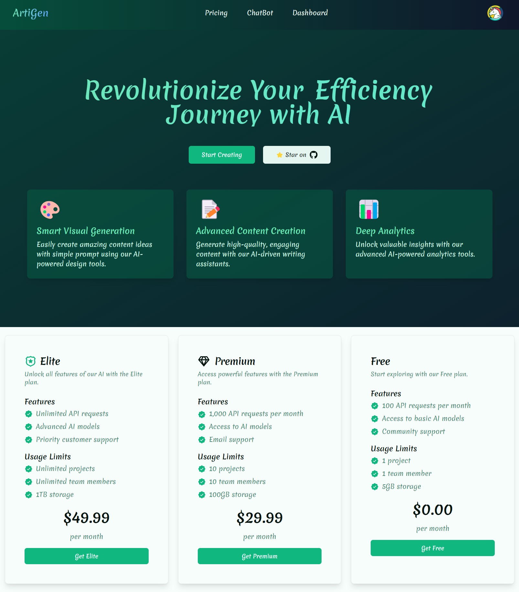
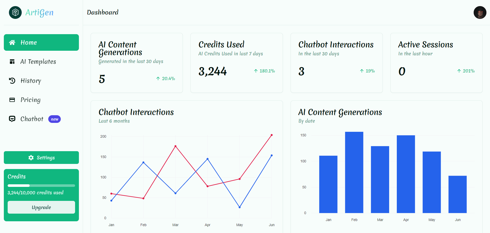
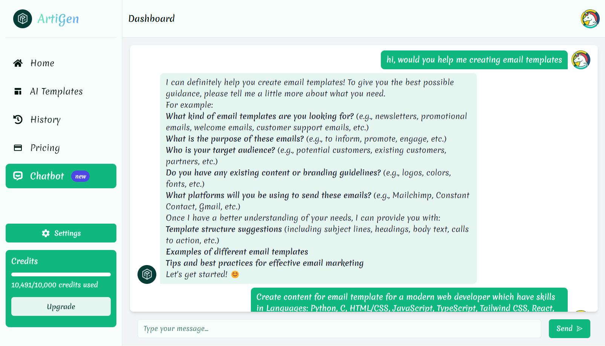
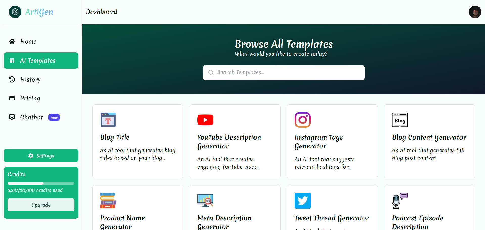

# ArtiGen: SaaS AI Content Generation Platform

ArtiGen is a cutting-edge AI content generation platform built with Next.js 14, Drizzle ORM, Gemini AI, TypeScript, Neon DB, and PostgreSQL. It leverages ShadCN UI with custom styles for an enhanced user interface. ArtiGen offers users a suite of AI-driven content generation templates and a chatbot with an advanced analytics dashboard. Users can easily update their profile information, including display name and profile picture, using a modern custom dialog.

## Features

- **AI Content Generation Templates**: Access a variety of AI-powered content generation templates.
- **Interactive Chatbot**: Engage with an AI chatbot for content creation and other queries.
- **Modern Analytics Dashboard**: View detailed analytics and insights.
- **User Profile Management**: Update display name and profile picture with ease.
- **Custom UI Design**: Sleek and modern UI with ShadCN UI components.

## Installation

1. Clone the repository:

   ```bash
   git clone https://github.com/Devsethi3/artigen.git
   ```

2. Navigate to the project directory:

   ```bash
   cd artigen
   ```

3. Install dependencies:

   ```bash
   npm install
   ```

4. Set up environment variables:

   Create a `.env` file in the root directory and add your environment variables.

5. Start the development server:

   ```bash
   npm run dev
   ```

## Preview

Here are some screenshots of the ArtiGen platform:

1. **Landing Page**

   

2. **User Dashboard**

   

3. **Chatbot**

   

4. **Templates**

   

## Demo

Check out the live demo of ArtiGen [here](https://artigen-nine.vercel.app).

## Contributing

We welcome contributions to enhance ArtiGen. Feel free to open issues or submit pull requests.

Thank you for checking out ArtiGen! If you have any questions or feedback, feel free to reach out. Happy content generating!
